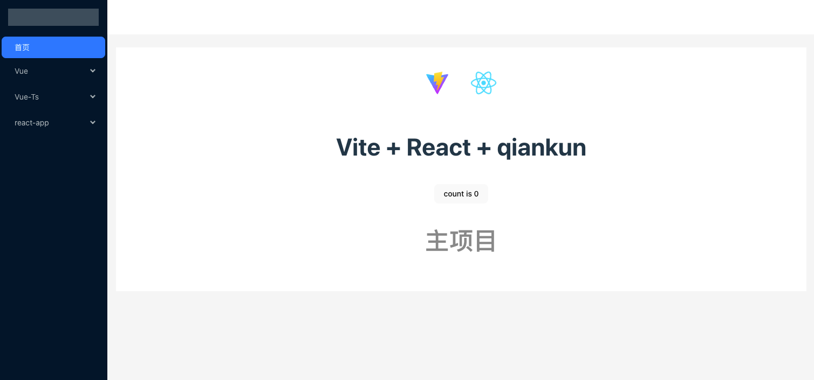

## 项目简介

    基于 React + Antd + Ts + qiankun + vue 的微前端基础框架
   []()
## 技术依赖

- React -（UI 框架）
- Vue -（UI 框架）
- Ant-Design - （组件库）
- TypeScript - （静态类型）
- Webpack、Vite （构建工具）
- react-router-dom、vue-router （ 路由 ）
- less

## 目录结构
```
主项目 viteApp
子项目 my-vue-app、my-vue-app-v3、react-webpack
```


```
react-webpack

|-- config              webpack配置文件
|-- dist                webpack构建目录
|-- public              html模板
|	|-- assets                静态资源文件，会被webpack解析为模块依赖
|-- src                 源码目录
|	|-- pages                 页面级组件
|	|-- router                路由管理
|	|-- App.tsx								根组件
|	|-- index.tsx							入口文件
|-- .babelrc            babel-loader 配置
|-- .editorconfig       IDE配置
|-- .gitignore          git提交时忽略的文件
|--	package.json        项目基本信息
|-- README.md           项目说明
|-- tsconfig.json						TypeScript配置
```

```
viteApp、my-vue-app、my-vue-app-v3

|-- dist                webpack构建目录
|-- public              静态资源文件
|-- src                 源码目录
|	|-- pages                 页面级组件
|	|-- router                路由管理
|	|-- App.tsx								根组件
|	|-- index.tsx							入口文件
|-- .babelrc            babel-loader 配置
|-- .eslintrc           eslint 配置
|-- .editorconfig       IDE配置
|--	package.json        项目基本信息
|-- README.md           项目说明
|-- tsconfig.json						TypeScript配置
```


## 使用

### 运行

```
yarn dev
yarn dev:vue
yarn dev:vueV3
yarn dev:react
```

